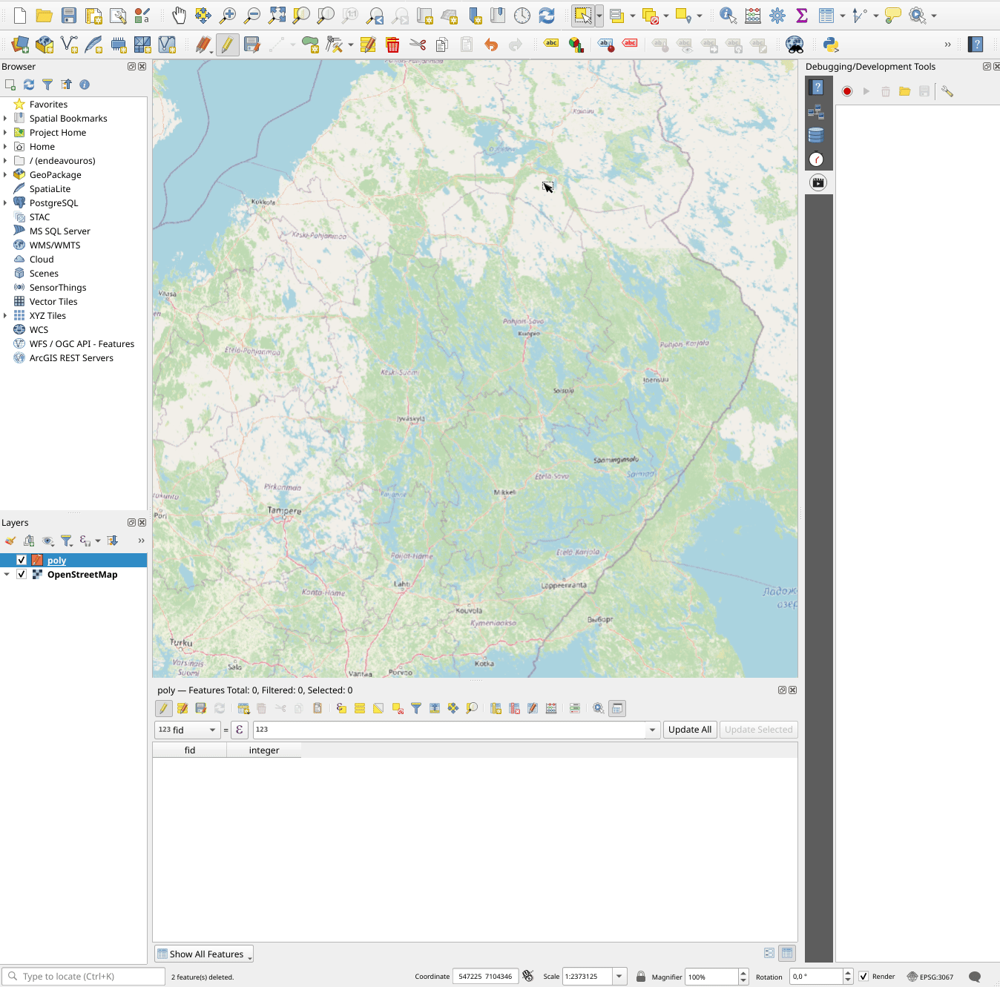

QGIS Macro Plugin
=================

The QGIS Macro Plugin extends QGIS development tools with a macro panel
that allows users to record and playback simple macros.

Features
--------

* Record and playback macros (mouse and keyboard events)
* Save macros to disk for later usage
* Optionally profile macros

Requirements
------------

* QGIS version **3.34** or higher (including QGIS 4)
* Python **3.12** or higher

.. toctree::
   :maxdepth: 2
   :caption: Contents

   getting-started
   core/index
   plugin/index
   changelog
